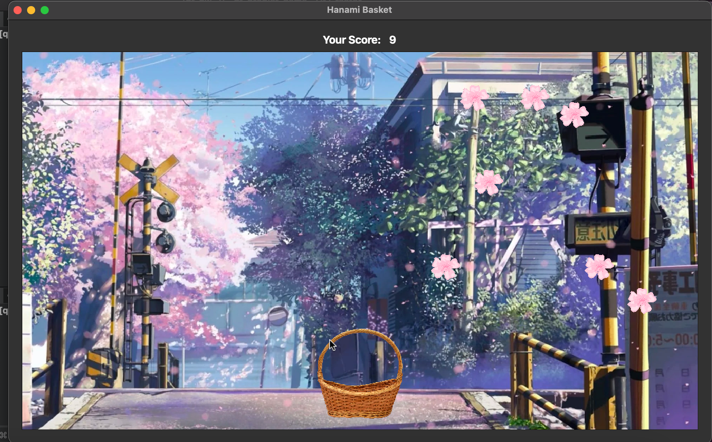

# Hanami Basket: How to Play the Grame

## Prerequisite

- Add Qt Multimedia component
  - Open the Qt Maintenance Tool.
  - Click on ‘Add or remove components’.
  - Search for ‘multimedia’ in the component list.
  - Install the component that matches your version of Qt.
- Open the [qt-droplet-game.pro](qt-droplet-game.pro) file in Qt Creator
- Run the game & start playing

- Use the left (⬅️) and right (➡️) arrow keys to move the basket and catch falling cherry blossoms

