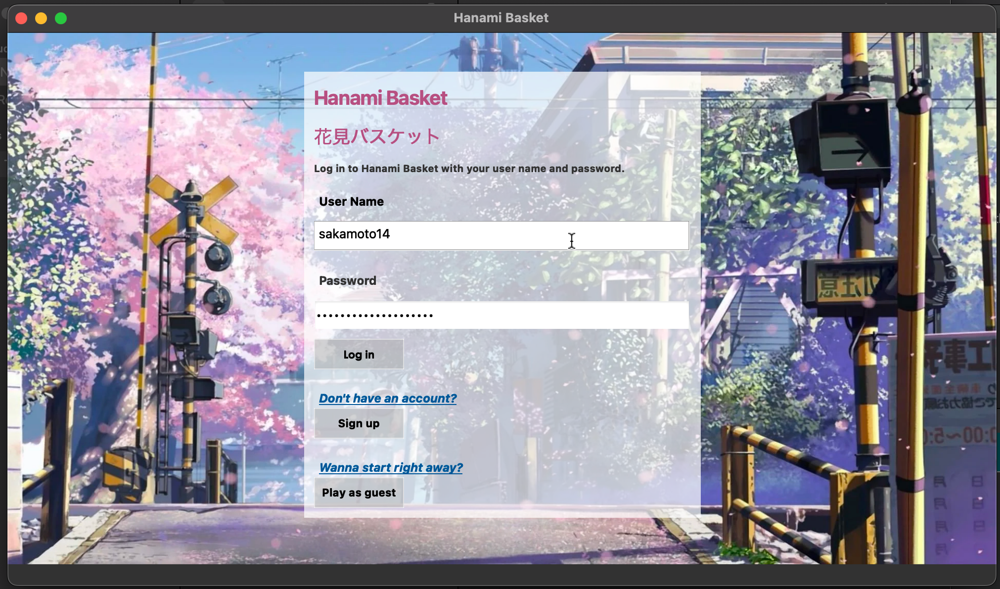
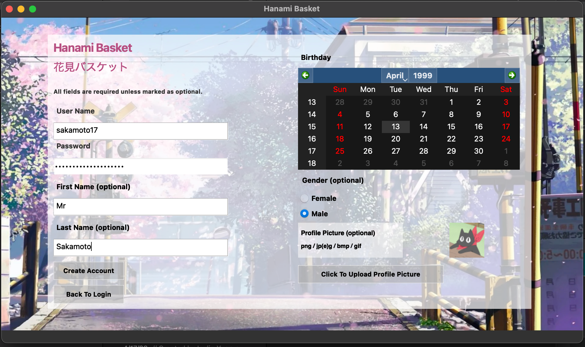
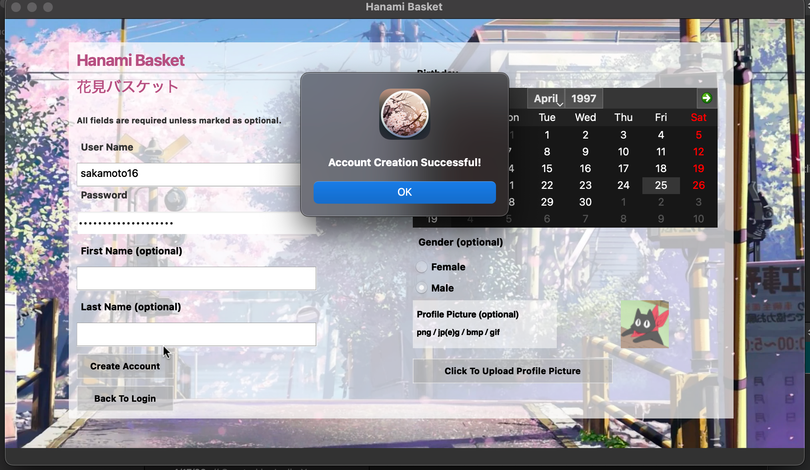
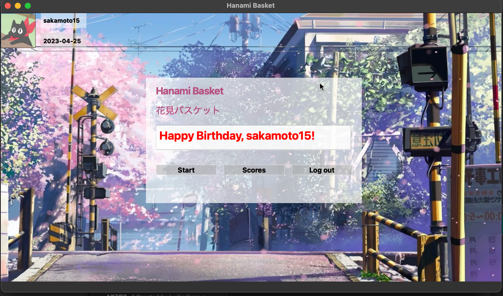
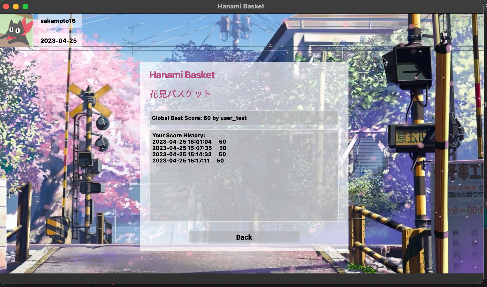
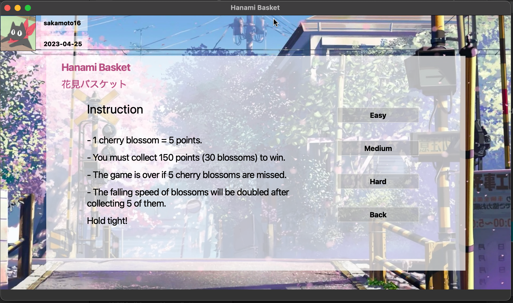
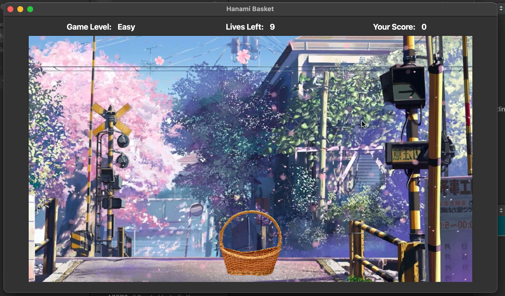
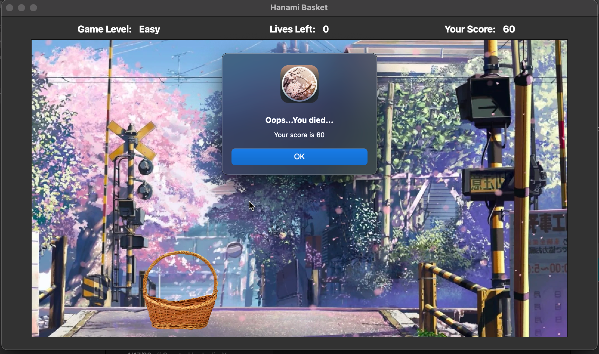
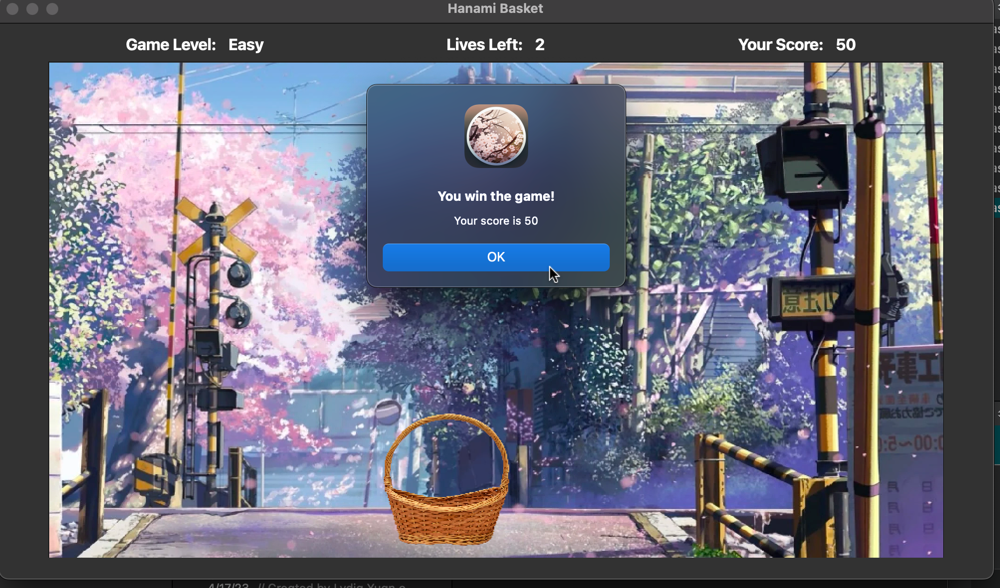

# Hanami Basket: How to Play the Grame

## Run it locally

1. Clone this repository to your local computer (Please make sure your local repo is named as **Hanami-Basket**)

   ```bash
   git clone https://github.com/YuanRuQian/Hanami-Basket Hanami-Basket
   ```

2. Add Qt Multimedia component

     - Open the Qt Maintenance Tool.

     - Click on ‘Add or remove components’.

     - Search for ‘multimedia’ in the component list.

     - Install the component that matches your version of Qt.


3. Open the [qt-droplet-game.pro](qt-droplet-game.pro) file in Qt Creator
4. Run the game & start playing

## Login Page



## Signup Page



### Signup Confirmation



## After Login or Signup Page

> If today happens to be the player's birthday, they will receive a special birthday greeting.




## Play as Guest
> Your score will not be recorded in guest mode

Choose `Play as Guest` at login page.


## Score Page



## Game Instructions & Game Level Page



## The Game

> Use the left (⬅️) and right (➡️) arrow keys to move the basket and catch falling cherry blossoms





## When the Player Loses the Game

Click on `OK` to return to the page after logging in or signing up.



## When the Player Wins the Game

> The score of 50 shown in the screenshot is solely for testing purposes, as the actual winning threshold is set at 150 (which, dare I say, is quite challenging even for the easy level).

Click on `OK` to return to the page after logging in or signing up.



