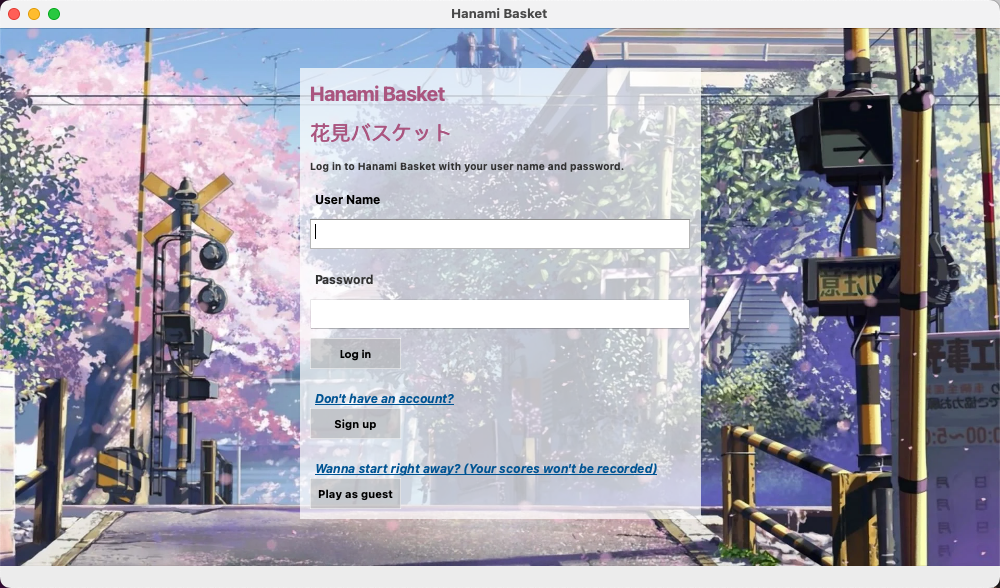

# Hanami Basket: How to Play the Grame

## Prerequisite

- Add Qt Multimedia component
  - Open the Qt Maintenance Tool.
  - Click on ‘Add or remove components’.
  - Search for ‘multimedia’ in the component list.
  - Install the component that matches your version of Qt.
- Open the [qt-droplet-game.pro](qt-droplet-game.pro) file in Qt Creator
- Run the game & start playing

## Login Page

## Signup Page

### Signup Confirmation

## After Login or Signup Page

- If today happens to be the player's birthday, they will receive a special birthday greeting.

## Play as Guest
> Your score will not be recorded in guest mode

## Score Page

// TODO

## Game Instructions & Game Level Page

// TODO

## The Game

- Use the left (⬅️) and right (➡️) arrow keys to move the basket and catch falling cherry blossoms

## When the Player Loses the Game

## When the Player Wins the Game

> The score of 50 shown in the screenshot is solely for testing purposes, as the actual winning threshold is set at 150 (which, dare I say, is quite challenging even for the easy level).

